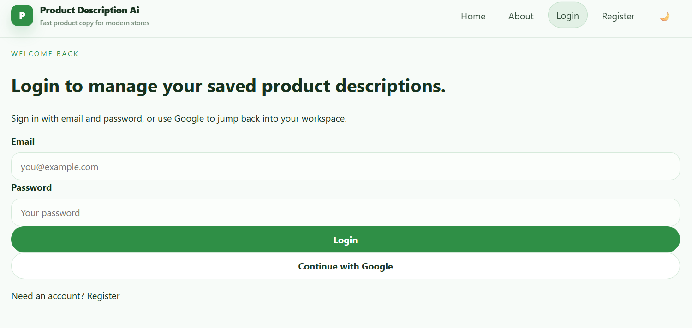
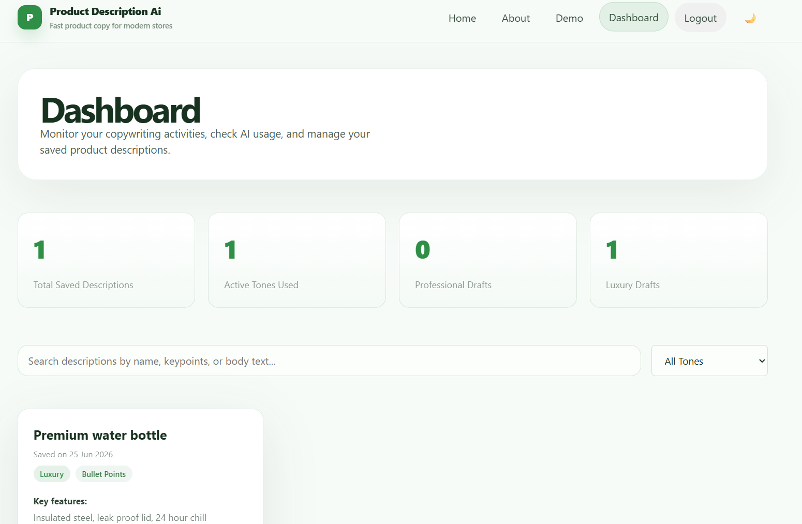

# 🚀 Product Description Generation AI

> AI-powered web application that generates high-quality, engaging, and SEO-friendly product descriptions using Large Language Models (LLMs).

<p align="center">
  <a href="https://product-description-ai-deployment.vercel.app/"><strong>🌐 Live Demo</strong></a> •
  <a href="https://productdescriptionaideployment.onrender.com"><strong>📚 API Docs</strong></a>
</p>

---

## 📖 Overview

Product Description Generation AI is a full-stack web application designed to help businesses, marketers, and e-commerce sellers generate compelling product descriptions within seconds.

The application leverages AI to create professional, human-like, and SEO-optimized content from simple product information, significantly reducing the time required to prepare product listings while maintaining quality and consistency.

---

# 🌐 Live Demo

| Service | URL |
|----------|-----|
| Frontend | https://product-description-ai-deployment.vercel.app/ |
| Backend | https://productdescriptionaideployment.onrender.com |
| API Documentation | https://productdescriptionaideployment.onrender.com/docs |

> **Note:** Backend is deployed on Render Free Tier. The first request after inactivity may take **30–60 seconds** to wake up.

---

# 📸 Screenshots

## Login



---

## Dashboard



---

## Generate Description


---

## Generated Result


---

# ✨ Features

- 🤖 AI-powered product description generation
- ✨ SEO-friendly content generation
- 🛍️ Optimized for e-commerce products
- 🔐 JWT-based authentication
- 👤 User Registration & Login
- 📜 History of generated descriptions
- ⚡ Fast API responses
- 📱 Fully responsive UI
- ☁️ Cloud deployment
- 🔒 Secure password hashing
- ✅ Input validation
- 🎨 Modern and intuitive interface

---

# 🛠 Tech Stack

## Frontend

- React
- TypeScript
- Vite
- Tailwind CSS
- React Router
- Axios

## Backend

- FastAPI
- Python
- Pydantic
- JWT Authentication
- Bcrypt

## Database

- MongoDB Atlas

## AI

- OpenAI API *(or Gemini API depending on implementation)*

## Deployment

- Vercel
- Render
- MongoDB Atlas

---

# 📁 Folder Structure

```text
ProductDescriptionAI
│
├── frontend
│   ├── public
│   ├── src
│   │   ├── assets
│   │   ├── components
│   │   ├── context
│   │   ├── hooks
│   │   ├── pages
│   │   ├── services
│   │   ├── utils
│   │   ├── App.tsx
│   │   └── main.tsx
│   ├── package.json
│   └── vite.config.ts
│
├── backend
│   ├── Utils
│   ├── models
│   ├── routers
│   ├── ai.py
│   ├── database
│   ├── models
│   ├── rate limit
│   ├── main.py
│   ├── requirements.txt
│   └── security
│
├── docs
│   └── screenshots
│
├── README.md
└── LICENSE
```

---

# ⚙️ Setup Instructions

## Clone Repository

```bash
git clone https://github.com/yourusername/ProductDescriptionAI.git

cd ProductDescriptionAI
```

---

## Frontend

```bash
cd frontend

npm install

npm run dev
```

Runs on

```
http://localhost:5173
```

---

## Backend

Create virtual environment

```bash
python -m venv venv
```

### Windows

```bash
venv\Scripts\activate
```

### Linux/macOS

```bash
source venv/bin/activate
```

Install dependencies

```bash
pip install -r requirements.txt
```

Start server

```bash
uvicorn app.main:app --reload
```

Runs on

```
http://localhost:8000
```

---

## Environment Variables

Create a `.env` file inside the backend directory.

```env
MONGODB_URI=your_mongodb_connection_string

JWT_SECRET=your_secret_key

AI_API_KEY=your_ai_api_key

AI_MODEL=your_model_name
```

---

# 📚 API Documentation

FastAPI automatically provides interactive API documentation.

### Swagger UI

```
http://localhost:8000/docs
```

### ReDoc

```
http://localhost:8000/redoc
```

## Authentication

### Register

```http
POST /auth/register
```

Request

```json
{
  "name": "John Doe",
  "email": "john@example.com",
  "password": "password123"
}
```

---

### Login

```http
POST /auth/login
```

Request

```json
{
  "email": "john@example.com",
  "password": "password123"
}
```

---

### Generate Product Description

```http
POST /generate
```

Request

```json
{
  "title": "Wireless Bluetooth Headphones",
  "category": "Electronics",
  "features": [
    "Bluetooth 5.3",
    "40 Hours Battery",
    "Noise Cancellation"
  ]
}
```

Example Response

```json
{
  "description": "Experience immersive sound with our Wireless Bluetooth Headphones..."
}
```

---

### History

```http
GET /history
```

---

### Delete History

```http
DELETE /history/{id}
```

---

# 🧠 Application Workflow

```text
User
   │
   ▼
React Frontend
   │
   ▼
FastAPI Backend
   │
   ▼
Input Validation
   │
   ▼
AI Model (OpenAI/Gemini)
   │
   ▼
Generated Description
   │
   ▼
MongoDB Database
   │
   ▼
Response to User
```

---

# 🔒 Security

- JWT Authentication
- Password Hashing (Bcrypt)
- Protected Routes
- Pydantic Validation
- Environment Variables
- CORS Protection
- Secure API Communication

---

# 🚀 Deployment

| Component | Platform |
|------------|----------|
| Frontend | Vercel |
| Backend | Render |
| Database | MongoDB Atlas |

---

# Known Limitations

- Render Free Tier enters sleep mode after inactivity.
- AI output quality depends on the prompt and selected model.
- API rate limits depend on the AI provider.
- Internet connection is required.
- Free-tier hosting may have slower response times.
- Large prompts may increase generation time.

---

# 🚀 Future Improvements

- Multiple AI model support
- Multi-language descriptions
- Prompt templates
- Product image analysis
- Bulk generation
- Export to PDF/Word
- SEO keyword scoring
- Admin dashboard
- Analytics
- Description quality scoring

---

# 🙏 Credits & Acknowledgements

Developed during the **Technology Business Incubator (TBI), Graphic Era (Deemed to be University)** internship.

Special thanks to the mentors, faculty members, and fellow interns for their guidance and valuable feedback throughout the development of this project.

This project uses the following open-source technologies:

- React
- FastAPI
- Tailwind CSS
- MongoDB Atlas
- Vercel
- Render
- OpenAI API / Gemini API
- Python Community

---

# 📄 License

This project is licensed under the MIT License.

Feel free to fork, modify, and use this project for educational or personal purposes.

---

<div align="center">

⭐ If you found this project useful, consider giving it a star on GitHub!

</div>
